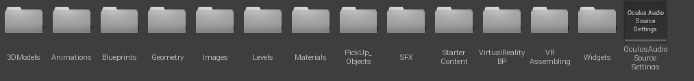
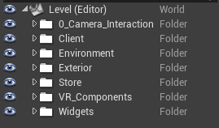
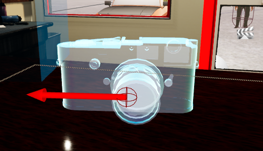
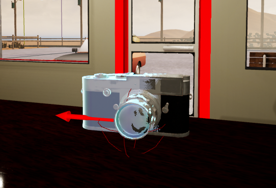
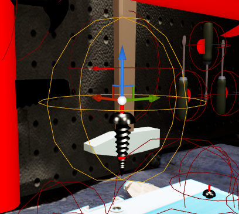
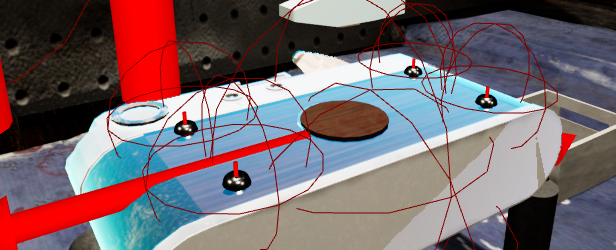
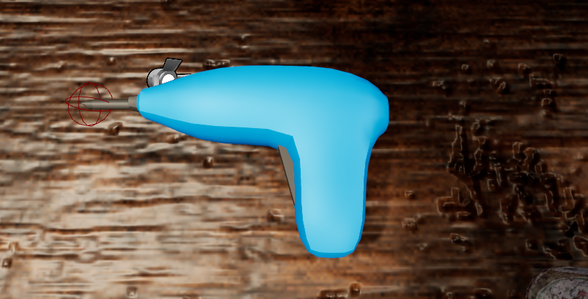
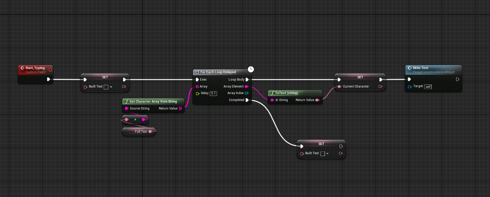
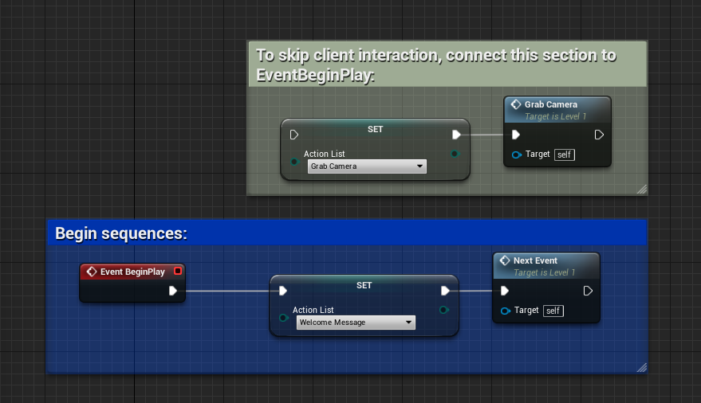

# All-Repairs-Co-VR
---
## Documentation
### **Content**

  

The following content is needed for the project to work properly and be scalable:

- 3D Models: All the meshes, textures and materials separated by object.
- Animations: Animated sequnces created in Unreal Engine.
- Blueprints: Characters and Enums.
- Geometry: Simple geometry meshes from the starter pack (includes only the ones needed).
- Images: Sprites for widget interaction.
- Levels: All scenes.
- Pickup Objects: All the actors that can be grabbable.
- SFX: Sound related assets. Songs and effects.
- Starter Content: Textures and materials from UE4 starter pack.
- Virtual Reality BP: VR Blueprints used in the user interaction.
- VR Assembling: Blueprints for assemble interaction.
- Widgets: Canvas and UX.
- Oculus Audios Source Settings: Settings for spatial audio (plugin needed)
    - For more information on how to implement Oculus Spatial Audio please visit: [Oculus Spatial Audio](https://developer.oculus.com/documentation/unreal/audio-osp-ue/)

### **Project Organization**

  

 

- Camera Interaction: As a proof of concept, it was decided to interact with a camera in order to fix it by disasseble and assemble it again (replacing parts of it). Every object used for this interaction is properly organized within this folder, including: pickup objects, holograms, meshes and actors.
- Client: The interaction with a client is crutial to understand how the company runs. Includes all character meshes, animations and targets.
- Environment: Includes exterior map, natural lights, post-processing volumes and skybox.
- Exterior: Static meshes on the exterior of the store to create a more realistic environment.
- Store: All meshes and pickup objects inside the store: furniture, tools, and interactable objects.
- VR Components: Pawn and Nav Mesh.
- Widgets: Interactable UI.
---

## Actors

### Holograms

  

- Contains a mesh component and applies a semi-transparent material to it. 
- Each hologram contains one or more slots to recognize which object can be attached to it. 
- Blockers: whenever an actor is attached to the hologram it can be grabbable again only if the hologram itself doesn't have any blocker active. Blockers can be other holograms or screwable holograms. 
- Initial: If the hologram starts with an actor attached to it and in same World Position, it should be explicit on Inital.
- Radius: Collider that detects all overlapped actors, if one has the same slot name, the hologram will take it as a child.

### Pickup Objects

  

- Contains one or several meshes but just one can be attached to holograms, other meshes must be their children.
- Slot: One single name to be identified, if the slot matches with an hologram, then the actor can be attached to the hologram.
- Simulate physics: If checked, the mesh and all its childs will simulate physics including gravity.

### Screwable Holograms

  

Includes the same components as a normal hologram adding:
- Screw Distance: Height of the screw that is goind to be placed in the hologram.
- Initial Screw Distance: indicates if a screw is already correctly placed and if yes how deep is it.

### Screwable Actors

  

- At interaction the mesh of the Screw -as a component- will rotate in the proper direction depending if it's being assembled or not.

### Screwdriver BP

  

- Can interact with different screws: Pressing A/X on the Oculus Touch Controllers will change the type of head in the screwdriver.
- Interaction: By pressing any Motion Controller Triggers and if the head of the screwdriver is close to any screw, the second one will rotate and moving on Z until is at the bottom of the hologram or outside.
- Ligth interaction: While interacting, a light will appear pointing towards the head of the screwdriver direction.

## Sequence & Blueprints

### Instructions Widget

  

The widget has a single instance of text that changes when is requested. 
As shown in the previous image, once the text is set the BP prints character at the time to simulate a typewriter machine effect.

### Level Blueprint
Includes all the sequences in game managed by a single Enum called "Action List".

- Event Begin Play

  

	- Connected directly with a custom event that redirects every sequence to different functions in a Switch Statement.
	- As a developer tool there is an option to connect the Event Begin Play directly to the "Grab Camera" sequence to skip the client interaction and test the assembly experience. 

